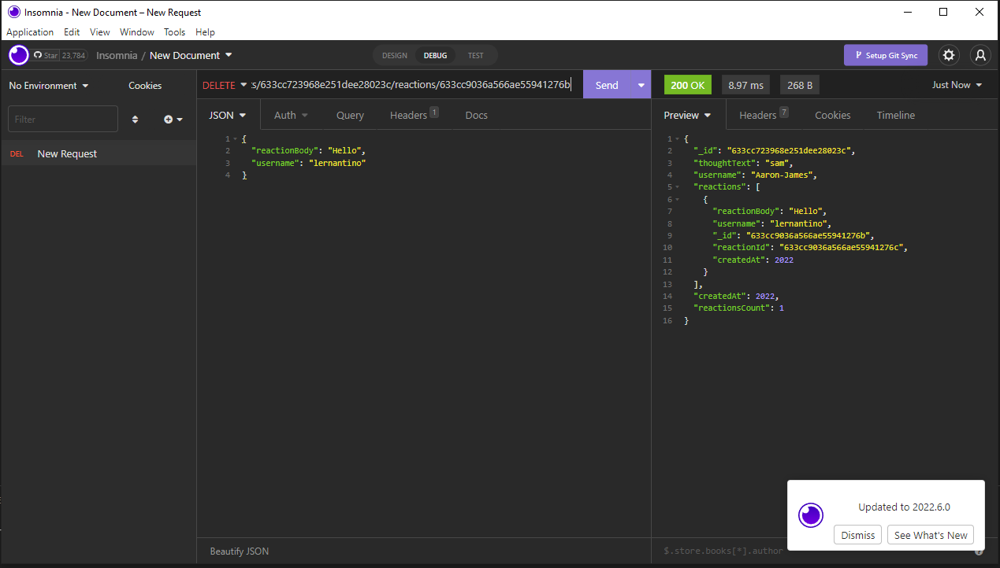

# Social Network API


## Description

  Back-End for a social network. It can manage Users, Friends, Thoughts, and Reactions to thoughts.

# Table of Contents

  1. [Description](#description)
  2. [Installation](#dnstallation)
  3. [Usage](#usage)
  4. [Questions](#questions)

## Installation

  Clone the repo. Run ```npm seed```. Run ```npm start```. Then you can test with postman or insomnia.

## Usage

  A back-End for managing Users, Thoughts, Reactions, and friends for Users.

## Questions

  You can send me any additional questions at my email Nabhahnk@gmail.com.

  My [GitHub](https://github.com/NabhahnK)